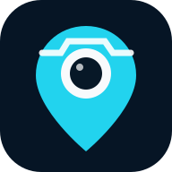

# GPS Map Camera & GPS Photo Editor



Aplikasi Android mobile-first untuk mengambil foto baru dengan GPS map stamp atau membuat versi GPS Map baru dari foto galeri. Data aktual/EXIF disimpan sebagai **Original Data**, sedangkan perubahan pengguna disimpan terpisah sebagai **Display Data**. Foto sumber tidak pernah ditimpa.

Versi terbaru: **1.0.1** · Package: `id.irvan.gpsmapcamera` · Project schema: **v2**

## Fitur yang berfungsi

- Kamera Android, file picker galeri, multi-select, dan permission saat dibutuhkan.
- GPS high accuracy, accuracy value, timeout/lock state, permission denied, dan lokasi manual.
- Pembacaan JPEG EXIF lokal: `DateTimeOriginal`, GPS latitude/longitude, altitude, dan orientation.
- Mini map dengan tile, pin, drag map, tap titik, zoom, pencarian, reverse geocoding, serta latitude/longitude manual.
- Edit alamat, tanggal, jam, detik, zona waktu, dan beberapa format tampilan.
- Original Data vs Display Data, edited flags, dan **Kembalikan ke Data Asli**.
- Stamp editor: drag, resize, opacity, ukuran map/teks, alignment, warna, dan show/hide field.
- Template bawaan serta preset custom, teks bebas yang dapat digeser, kegiatan, catatan, dan logo.
- Undo/redo, Original/Result comparison, autosave, resume draft, duplicate project, dan migration.
- Export JPEG Maximum/High/Medium dari source resolusi tinggi, file baru, share, dan MediaStore Android.
- Batch membaca metadata tiap foto secara individual dan export berurutan.
- Light/dark mode, PWA shell offline, IndexedDB local storage, APK/AAB, dan GitHub Actions.

## Teknologi

- UI/editor: JavaScript ES Modules + HTML Canvas + CSS (tanpa dependency runtime web).
- Storage: IndexedDB; source `Blob`, thumbnail, project, settings, dan last export.
- Android: Java 17, Android WebView host, MediaStore, LocationManager, dan native JavaScript bridge.
- Build: Node.js 20+, Gradle 9.5, Android Gradle Plugin 9.3, compile/target SDK 37.
- Map default: OpenStreetMap raster tiles; provider dikonfigurasi terpusat di `app.config.json`.

Tidak adanya framework/dependency web eksternal membuat clone, audit, dan build lebih sederhana. Struktur tetap modular agar file yang relevan mudah ditemukan saat repository diedit kembali melalui ChatGPT.

## Menjalankan versi web

Persyaratan: Node.js 20 atau lebih baru.

```bash
npm ci
npm run dev
```

Buka `http://localhost:4173`. Kamera dan GPS browser memerlukan `localhost` atau HTTPS.

Validasi lengkap:

```bash
npm run check
```

Perintah tersebut menjalankan lint/syntax/import check, unit test, dan menghasilkan `dist/`.

## Build APK debug

Persyaratan lokal:

- JDK 17.
- Android SDK Platform 37.
- Android SDK Build Tools 36.0.0.
- Node.js 20+ dan npm.
- Android Studio yang mendukung AGP 9.3, atau Gradle 9.5.

```bash
npm ci
npm run android:debug
```

Gradle otomatis menjalankan web build sebelum Android build. Hasil:

```text
android/app/build/outputs/apk/debug/app-debug.apk
```

Alternatif di Android Studio: buka folder `android`, tunggu sync selesai, lalu pilih **Build > Build APK(s)**.

## Build release APK dan AAB

Tanpa signing, Gradle dapat menghasilkan artefak release yang belum siap dipasang. Untuk signed release, set environment berikut:

```bash
export ANDROID_KEYSTORE_PATH=/absolute/path/release.jks
export ANDROID_KEYSTORE_PASSWORD='...'
export ANDROID_KEY_ALIAS='...'
export ANDROID_KEY_PASSWORD='...'
npm run android:release
```

Hasil berada di:

```text
android/app/build/outputs/apk/release/app-release.apk
android/app/build/outputs/bundle/release/app-release.aab
```

Keystore dan password tidak boleh masuk repository. `.gitignore` sudah mengecualikan keystore, secret, cache, dan build output.

## GitHub Actions dan Releases

Workflow `.github/workflows/android.yml` melakukan:

1. Checkout source.
2. Setup Node 24, JDK 17, Gradle 9.5, dan Android SDK 37.
3. `npm ci` lalu lint, test, dan web build.
4. Build debug APK pada push/PR dan menyimpannya sebagai artifact.
5. Pada tag `vMAJOR.MINOR.PATCH`, validasi versi dan signing secrets.
6. Build signed APK + AAB, checksum SHA-256, dan GitHub Release.

Tambahkan empat repository secrets berikut sebelum membuat tag release:

- `ANDROID_KEYSTORE_BASE64`
- `ANDROID_KEYSTORE_PASSWORD`
- `ANDROID_KEY_ALIAS`
- `ANDROID_KEY_PASSWORD`

Encode keystore untuk secret pertama:

```bash
base64 -w 0 release.jks
```

Di macOS gunakan `base64 < release.jks | tr -d '\n'`.

Lihat [panduan release](docs/RELEASING.md).

## Mengganti versi

Versioning mengikuti `MAJOR.MINOR.PATCH`.

1. Ubah `app.versionName` dan naikkan `app.versionCode` di `app.config.json`.
2. Samakan `version` di `package.json`.
3. Tambahkan isi `CHANGELOG.md`.
4. Jalankan `npm run version:check` dan `npm run check`.
5. Commit, kemudian buat tag yang sama, misalnya `v1.1.0`.

## Struktur folder

```text
src/
  components/    shared UI, icons, layout, dialogs
  config/        runtime config loader
  core/          router and application state store
  editor/        canvas renderer and undo/redo history
  models/        project schema, settings, templates, migrations
  screens/       home, editor, map picker, projects, batch, settings
  services/      camera/gallery, GPS, EXIF, map, image, export
  storage/       IndexedDB repositories and geocode cache
  utils/         date, geo, async, ID, and text helpers
android/         native Android host and Gradle project
public/          PWA entry, manifest, service worker, icons
scripts/         dependency-free build, dev server, lint, version check
tests/           unit tests
docs/            architecture and release notes
```

Arsitektur dan alur data lebih lengkap ada di [docs/ARCHITECTURE.md](docs/ARCHITECTURE.md).

## Konfigurasi terpusat

`app.config.json` menyimpan:

- nama app, package ID, version name/code, dan schema version;
- feature flags;
- map providers, default zoom, serta batas zoom;
- geocoding endpoint, bahasa, cache TTL, serta rate limit;
- kualitas, batas megapixel, JPEG quality, dan pola nama export.

Untuk provider ber-API-key, jangan commit key. Inject key pada langkah build atau gunakan konfigurasi privat/CI. `.env.example` hanya mendokumentasikan nama variabel dan tidak berisi secret.

### Menambah map style/provider

Default repository hanya mengaktifkan **Standard OpenStreetMap**. Satellite, Hybrid, atau Terrain dapat ditambahkan ke array `maps.providers` jika provider pilihan Anda mendukungnya dan terms/API key sudah dipenuhi:

```json
{
  "id": "my-satellite",
  "label": "Satellite",
  "style": "satellite",
  "enabled": true,
  "tileUrl": "https://provider.example/{z}/{x}/{y}.jpg?key=BUILD_INJECTED_KEY",
  "attribution": "© Provider",
  "maxZoom": 19
}
```

UI editor membaca provider aktif secara dinamis. Jangan menghapus attribution dari hasil map.

## Kebijakan OpenStreetMap dan geocoding

Repository memakai layanan komunitas OSM secara ringan untuk pengembangan/volume moderat. Sebelum merilis ke banyak pengguna, pengembang aplikasi wajib membaca dan mematuhi:

- [OpenStreetMap Tile Usage Policy](https://operations.osmfoundation.org/policies/tiles/)
- [Nominatim Usage Policy](https://operations.osmfoundation.org/policies/nominatim/)

Implementasi ini:

- memakai URL tile HTTPS yang benar dan menampilkan attribution;
- mengandalkan browser cache serta tidak melakukan prefetch/offline bulk tile download;
- membatasi geocoding ke satu request per lebih dari satu detik;
- menyimpan cache geocode lokal;
- hanya mencari ketika pengguna menekan **Cari**, tanpa autocomplete;
- menjalankan request secara berurutan, bukan paralel;
- membuat endpoint dapat diganti melalui satu konfigurasi tanpa mengubah kode editor;
- tidak menjalankan bulk reverse geocoding otomatis pada batch import.

Untuk aplikasi komersial atau jumlah pengguna besar, gunakan provider ber-SLA, proxy/cache yang patuh, atau instance Nominatim sendiri.

## Permission Android

| Permission | Alasan | Kapan diminta |
| --- | --- | --- |
| `CAMERA` | Memotret dari mode kamera | Saat Kamera dibuka |
| `ACCESS_FINE_LOCATION` | Koordinat GPS akurat | Saat lokasi aktual diminta |
| `ACCESS_COARSE_LOCATION` | Fallback lokasi perkiraan | Bersama permission lokasi |
| `READ_MEDIA_IMAGES` / legacy read | Kompatibilitas Android media | Gallery memakai system picker bila tersedia |
| `WRITE_EXTERNAL_STORAGE` max API 28 | Simpan hasil pada Android lama | Hanya relevan untuk API lama |
| `INTERNET` | Tile map, search, reverse geocoding | Tidak memblokir editor offline |
| `ACCESS_NETWORK_STATE` | Status offline | Otomatis |

Foto galeri dibuka melalui system document picker. Izin tidak diminta pada startup.

## Privasi dan integritas data

- Tidak ada backend, analytics, tracker, login, atau upload otomatis.
- Source photo disimpan sebagai `sourceBlob` di project dan hasil export dibuat sebagai file baru.
- `originalData` tidak dimutasi oleh editor.
- `displayData` dan `editedFields` mencatat perubahan manual.
- Android backup dinonaktifkan agar project lokasi tidak terkirim otomatis ke cloud backup.
- Geocoding/map adalah satu-satunya network feature default; editor, EXIF, project, dan export dasar tetap berjalan offline.

## Troubleshooting

### Kamera tidak terbuka

- Pastikan permission Kamera di Android Settings diizinkan.
- Tutup aplikasi lain yang sedang memakai kamera.
- Mode web harus berjalan pada HTTPS atau `localhost`; APK memakai native file chooser.

### GPS terus “Mencari lokasi”

- Aktifkan Location/GPS, pindah ke area lebih terbuka, lalu coba kembali.
- Periksa bahwa precise location diizinkan.
- Aplikasi tidak diam-diam menerima koordinat lama saat lock gagal; gunakan location picker bila perlu.

### Foto galeri tidak mempunyai lokasi/tanggal

- Banyak aplikasi chat/social media menghapus EXIF.
- GPS tidak dibuat palsu. Pilih **Edit Lokasi** atau **Lokasi Saya**.
- Jika `DateTimeOriginal` tidak ada, pilih tanggal/jam manual.

### Map atau alamat tidak muncul

- Editor tetap bekerja saat offline; hubungkan internet untuk tile/geocoding.
- Periksa endpoint/provider di `app.config.json`.
- Pastikan attribution dan usage policy provider tetap dipenuhi.
- Provider komunitas tidak menjamin SLA dan dapat membatasi traffic berat.

### Export resolusi maksimum gagal

- Foto 30–50 MP dapat melebihi RAM WebView perangkat entry-level.
- Preview selalu memakai resolusi kecil; final render memakai source.
- Coba kualitas **High** (maks. 24 MP) atau **Medium** (maks. 12 MP).

### Project lama tidak terbuka setelah update

- Jangan mengubah `originalData` atau `schemaVersion` tanpa migration.
- Tambahkan migration di `src/models/project.js` dan fixture test sebelum release.

### Android build gagal

- Pastikan JDK 17, SDK Platform 37, Build Tools 36.0.0, dan Gradle 9.5 tersedia.
- Jalankan `npm run check` terlebih dahulu.
- Hapus hanya cache build lokal yang aman (`android/.gradle`, `android/app/build`) lalu build ulang.
- Baca error pertama pada log, bukan hanya ringkasan terakhir.

## Konvensi Git

Branch utama: `main`. Gunakan `develop`, `feature/...`, atau `fix/...` bila dibutuhkan.

Contoh commit:

```text
feat: add GPS map editor
fix: repair camera permission handling
feat: add gallery EXIF reader
ui: redesign home screen
fix: prevent original image overwrite
perf: improve image export performance
```

Setiap perubahan besar harus memeriksa kamera, galeri, GPS, EXIF, map, location picker, date/time, editor, project, export, share, permission, settings, layout overflow, broken imports, dan migration project.

## License

[MIT](LICENSE)
